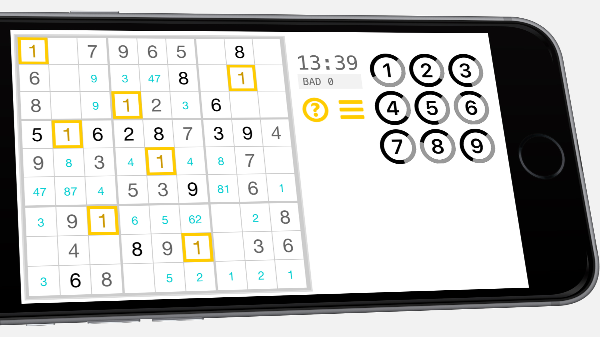

# TapTapSudoku

One tap to pencil, two taps to lock-in the number.
Developed entirely with react-native.

We developed this app for the pure pleasure of a daily sudoku.
We found no other app that would offer this usability.
It's free of charge. No ads. We don't collect any data.
No rankings, no competitions. It's just you solving a game.



## Prerequisites

Install node, react-native, react-native-cli

## Dependencies

See also package.json.
```
"react": "16.6.0-alpha.8af6728",
"react-native": "0.57.4"
```

## Build

Clone this repo.
```
npm install
react-native link
react-native run-ios or react-native run-android.
```

## Play

You can find TapTapSudoku at

<a href="https://itunes.apple.com/us/app/taptapsudoku/id1320628951?mt=8" style="display:inline-block;overflow:hidden;background:url(https://linkmaker.itunes.apple.com/assets/shared/badges/en-us/appstore-lrg.svg) no-repeat;width:135px;height:40px;background-size:contain;"></a>
<a href="https://play.google.com/store/apps/details?id=com.zapalote.taptapsudoku" style="display:inline-block;overflow:hidden;background:url(google-play-badge.png) no-repeat;width:135px;height:40px;background-size:contain;"></a>


[](https://itunes.apple.com/us/app/taptapsudoku/id1320628951?mt=8)

and

[ | width=135](https://play.google.com/store/apps/details?id=com.zapalote.taptapsudoku)

## Contributing

Please read [CONTRIBUTING.md](https://gist.github.com/PurpleBooth/b24679402957c63ec426) for details on our code of conduct, and the process for submitting pull requests to us.

## Authors

* **Miguel Albrecht** - [zapalote](https://zapalote.com/TapTapSudoku/)

## License

This project is licensed under the MIT License - see the [LICENSE.md](LICENSE.md) file for details

## Acknowledgments

* Thanks to Neo (nihgwu@live.com) who gave inspiration and shared his react native code.
* Thanks to David Bau who developed and shared the original sudoku generator
* Thanks to Blagovest Dachev who ported David Bau's algorithm to Node.js
* App development and graphics by zapalote.com.
